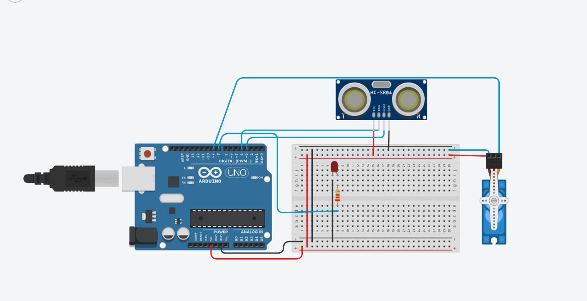
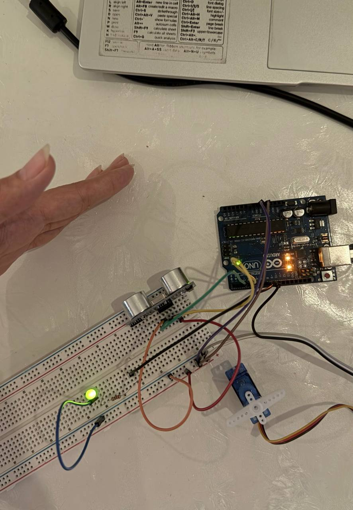

# Ultrasonic Servo Control System

Arduino-based distance-responsive system that integrates an HC-SR04 ultrasonic sensor, servo motor, and LED indicator for automatic proximity-based control.

## Overview

This project demonstrates the integration of sensing, actuation, and visual feedback using an Arduino Uno.

The HC-SR04 ultrasonic sensor continuously measures the distance to nearby objects. When an object is detected within **10 cm**, the Arduino commands the servo motor to rotate from **0° to 90°** and activates an LED indicator.

When the object moves beyond the detection threshold, the servo automatically returns to its original **0° position** and the LED turns OFF.

The system was first developed and tested using **Tinkercad simulation** and then successfully implemented using physical hardware.

## Key Features

- Real-time ultrasonic distance measurement
- Distance-triggered servo control
- Adjustable detection threshold
- Adjustable servo response angle
- LED visual status indication
- Tinkercad simulation
- Physical hardware implementation

## Components

| Component | Quantity |
|---|---:|
| Arduino Uno | 1 |
| HC-SR04 Ultrasonic Sensor | 1 |
| Servo Motor | 1 |
| LED | 1 |
| 220 Ω Resistor | 1 |
| Breadboard | 1 |
| Jumper Wires | As required |

## Pin Configuration

| Component | Function | Arduino Connection |
|---|---|---|
| HC-SR04 | Trigger | D4 |
| HC-SR04 | Echo | D3 |
| HC-SR04 | VCC | 5V |
| HC-SR04 | GND | GND |
| Servo Motor | Signal | D9 |
| Servo Motor | VCC | 5V |
| Servo Motor | GND | GND |
| LED | Control | D8 |

## System Operation

```text
          ┌─────────────────────┐
          │   HC-SR04 Sensor    │
          │  Measure Distance   │
          └──────────┬──────────┘
                     │
                     ▼
          ┌─────────────────────┐
          │     Arduino Uno     │
          │  Distance ≤ 10 cm?  │
          └──────────┬──────────┘
                     │
              ┌──────┴──────┐
              │             │
             YES            NO
              │             │
              ▼             ▼
       Servo → 90°      Servo → 0°
       LED → ON         LED → OFF
```

## Control Logic

The system operates using a simple distance threshold:

| Condition | Servo Position | LED |
|---|---:|---|
| Distance ≤ 10 cm | 90° | ON |
| Distance > 10 cm | 0° | OFF |

## Customization

The system behavior can be easily adjusted without modifying the main control logic.

Only two parameters need to be changed:

```cpp
const int triggerDistance = 30;
const int activeAngle = 90;
```

- `triggerDistance` — Sets the distance threshold in centimeters at which the system is activated.
- `activeAngle` — Sets the servo angle when an object is detected within the specified distance.

For example:

```cpp
const int triggerDistance = 15;
const int activeAngle = 45;
```

This configuration will activate the system when an object is **15 cm or closer** and move the servo to **45°**.
## Implementation & Demo

### Tinkercad Simulation

The circuit and control logic were first designed and tested using Tinkercad.

<p align="center">
  
</p>

▶️ [Watch Tinkercad Simulation Demo](demos/tinkercad_demo.mp4)

### Hardware Implementation

The system was then implemented and successfully tested using physical hardware.

<p align="center">
  
</p>

▶️ [Watch Hardware Demo](demos/hardware_demo.mp4)

